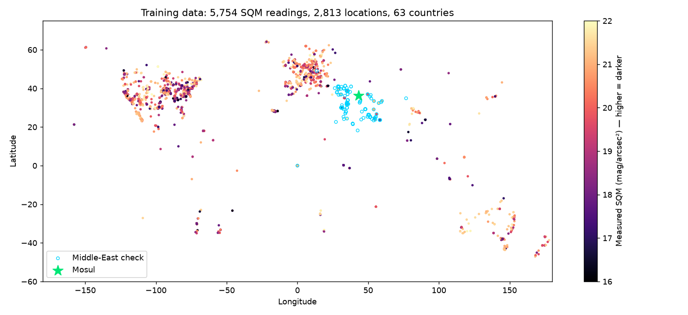
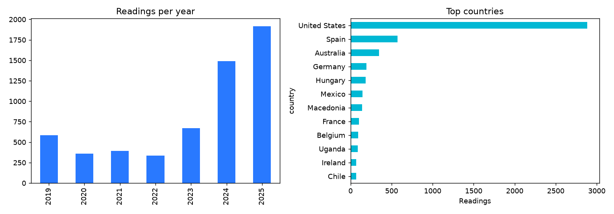
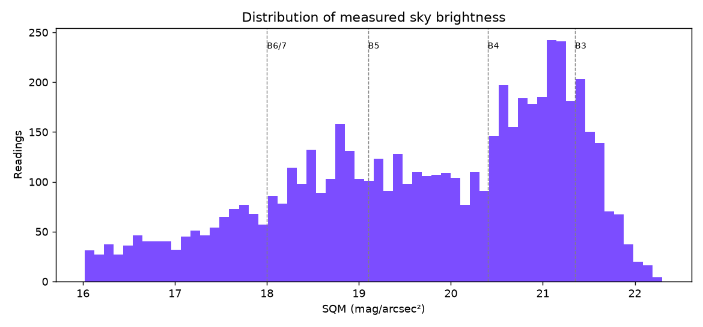
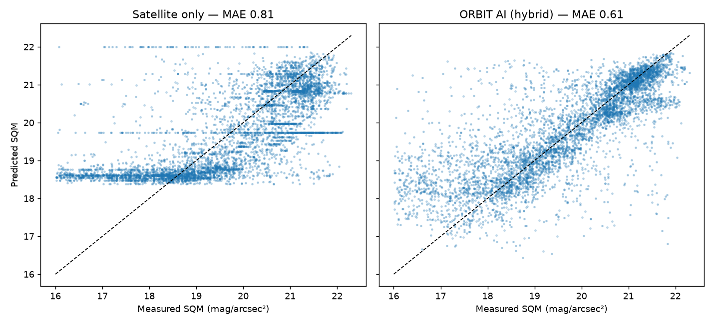
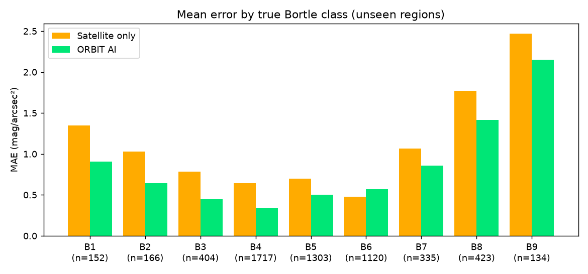
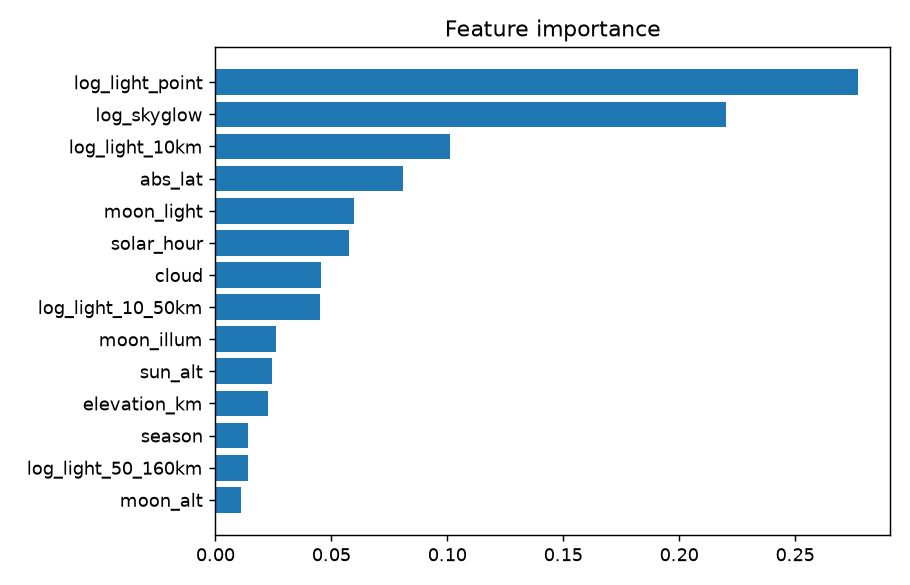
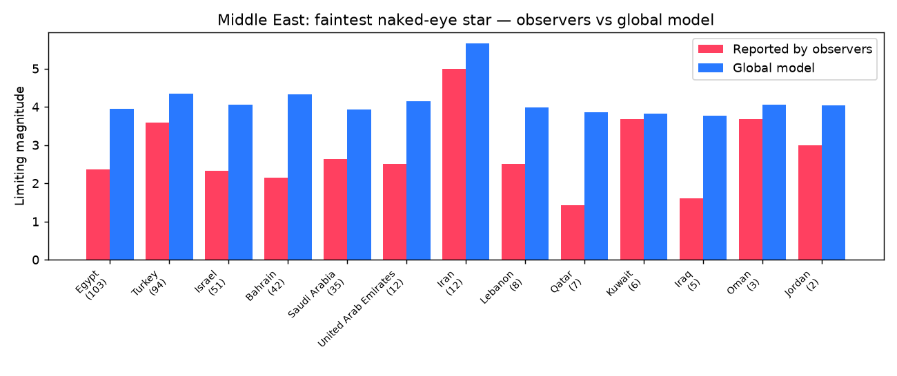
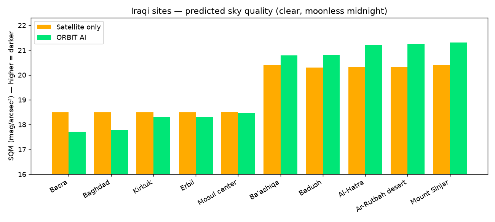

# تقرير نموذج ORBIT AI

*تم توليده تلقائياً بـ `ml/05_make_report.py` بتاريخ 2026-09-26T08:03. كل الأرقام محسوبة من البيانات.*

## 1. الخلاصة
- **الذكاء الاصطناعي يقلل خطأ تقدير سطوع السماء بنسبة 25.7%** مقارنة بالقمر الصناعي وحده.
- متوسط الخطأ **0.605 mag/arcsec²** مقابل 0.814.
- الاختبار على **مناطق جغرافية ما شافها النموذج أبداً**.
- النوع: **Machine Learning**، بخوارزمية Histogram Gradient Boosting مع قيود فيزيائية.
- التدريب: 5,754 قياس أرضي حقيقي، من 2,813 موقع بـ 63 دولة.

## 2. البيانات
| المصدر | الدور | الوحدة |
|---|---|---|
| Globe at Night (NOIRLab)، ٢٠١٩–٢٠٢٥ | **الهدف**: قراءات SQM الأرضية | mag/arcsec² |
| NASA GIBS، طبقة VIIRS Black Marble (٢٠١٦) | ضوء المدن (2,185 صورة) | مؤشر ضوء ٠–١ |
| خوارزمية SunCalc | القمر والشمس | درجات / نسبة |

**مراحل التنظيف:**
| المرحلة | عدد الصفوف |
|---|---|
| البيانات الخام | 134,302 |
| وقت ومكان وغيوم صالحة | 133,911 |
| ليل فقط (الشمس تحت −١٢°) | 69,740 |
| بيها قراءة SQM بين ١٦ و٢٢٫٣ | 6,462 |
| حذف القراءات المكتوبة باليد كأرقام صحيحة | −579 |
| **النهائي (بعد إزالة التكرار)** | **5,754** |

**الأشكال:**
- 
- 
- 

## 3. النموذج
- **الخوارزمية:** `HistGradientBoostingRegressor` من scikit-learn.
  - ٤٠٠ شجرة، وعمق كل شجرة ٥.
  - learning rate ‏٠٫٠٥.
  - دالة الخسارة: absolute error.
- **القيود الفيزيائية:** `log_light_point`: ↑ضوء=↓mag, `log_light_10km`: ↑ضوء=↓mag, `log_light_10_50km`: ↑ضوء=↓mag, `log_light_50_160km`: ↑ضوء=↓mag, `log_skyglow`: ↑ضوء=↓mag, `moon_light`: ↑ضوء=↓mag, `elevation_km`: ↑=↑mag
- **المقارنة:** مع Linear Regression (يمثل القمر الصناعي وحده)، ومع Random Forest (٢٠٠ شجرة).
- **التشغيل:** يُصدَّر لـ JSON ويشتغل بالمتصفح. التطابق مع sklearn: فرق أقل من ٠٫٠٠٠٠٣.

## 4. الدقة
**طريقة الاختبار:** ٥ طيّات GroupKFold، مجمّعة بمربعات ٠٫٥° (تقريباً ٥٠ كم).

| المقياس | القمر الصناعي وحده | Random Forest | **ORBIT AI** |
|---|---|---|---|
| MAE | 0.814 | 0.621 | **0.605** |
| RMSE | 1.085 | 0.892 | 0.911 |
| R² | 0.476 | 0.646 | 0.63 |
| الخطأ الوسيط | 0.619 | 0.397 | **0.352** |
| نسبة التوقعات ضمن ±٠٫٥ mag | 42.0% | 58.0% | **61.6%** |
| نسبة التوقعات ضمن ±١ mag | 70.1% | 80.0% | **80.5%** |
| صنف Bortle صحيح | 41.1% | 48.7% | **51.2%** |
| صنف Bortle صحيح ±١ | 79.3% | 84.7% | **84.1%** |

**ملاحظة بصراحة:** Random Forest قريب جداً من ORBIT AI. اخترنا ORBIT AI لأن متوسط خطأه أقل، ولأنه يلتزم بالفيزياء. بدون القيود كانت بغداد تطلع أظلم من الموصل.

**شنو ينظر إليه النموذج (Permutation importance):**
| الميزة | الأهمية |
|---|---|
| `log_light_point` | 27.7% |
| `log_skyglow` | 22.0% |
| `log_light_10km` | 10.1% |
| `abs_lat` | 8.1% |
| `moon_light` | 6.0% |
| `solar_hour` | 5.8% |
| `cloud` | 4.6% |
| `log_light_10_50km` | 4.5% |
| `moon_illum` | 2.6% |
| `sun_alt` | 2.5% |
| `elevation_km` | 2.2% |
| `season` | 1.4% |
| `log_light_50_160km` | 1.4% |
| `moon_alt` | 1.1% |

## 5. فحص الشرق الأوسط
الأرصاد: 380 رصد بالعين المجردة من 13 دولة.
- الراصدون يشوفون نجوم لحد قدر **2.76** بالمعدل.
- النموذج العالمي يتوقع **4.15**.
- ارتباط Spearman = 0.261.

**الاستنتاج:** سماء منطقتنا أسوأ من التوقع العالمي، على الأرجح بسبب الغبار والضباب. هذا يبرر المعايرة المحلية بالصور.

| الدولة | عدد الأرصاد | المرصود | النموذج |
|---|---|---|---|
| Egypt | 103.0 | 2.36 | 3.95 |
| Turkey | 94.0 | 3.59 | 4.34 |
| Israel | 51.0 | 2.33 | 4.05 |
| Bahrain | 42.0 | 2.14 | 4.32 |
| Saudi Arabia | 35.0 | 2.63 | 3.93 |
| United Arab Emirates | 12.0 | 2.5 | 4.14 |
| Iran | 12.0 | 5.0 | 5.66 |
| Lebanon | 8.0 | 2.5 | 3.98 |
| Qatar | 7.0 | 1.43 | 3.86 |
| Kuwait | 6.0 | 3.67 | 3.83 |
| Iraq | 5.0 | 1.6 | 3.76 |
| Oman | 3.0 | 3.67 | 4.06 |
| Jordan | 2.0 | 3.0 | 4.03 |

## 6. توقعات المواقع العراقية
الظروف: سماء صافية، بلا قمر، منتصف الليل.

| الموقع | القمر الصناعي | **ORBIT AI** | Bortle | أخفت نجم |
|---|---|---|---|---|
| Basra | 18.50 | **17.71** | 7 | 3.7 |
| Baghdad | 18.50 | **17.78** | 7 | 3.8 |
| Kirkuk | 18.50 | **18.30** | 6 | 4.2 |
| Erbil | 18.50 | **18.31** | 6 | 4.2 |
| Mosul center | 18.51 | **18.46** | 6 | 4.3 |
| Ba'ashiqa | 20.39 | **20.79** | 4 | 6.0 |
| Badush | 20.30 | **20.81** | 4 | 6.0 |
| Al-Hatra | 20.32 | **21.20** | 4 | 6.2 |
| Ar-Rutbah desert | 20.31 | **21.25** | 4 | 6.3 |
| Mount Sinjar | 20.41 | **21.31** | 4 | 6.3 |

## 7. صور المصوّر المحلي
عدد الصور: **9**، ملتقطة بالموبايل بتاريخ ٢٨/٨/٢٠٢٤ بمنطقتين: نادي الشلالات (أطراف الموصل الشمالية) ومنطقة سكنية.

**لماذا لم نقِس السطوع من هذه الصور؟** الصور مأخوذة بوضع Night Mode في الموبايل، وهذا الوضع يدمج عدة لقطات ويعدّل السطوع بالذكاء الاصطناعي. والصور أيضاً وصلت عبر تطبيق مراسلة مسح بياناتها (EXIF: زمن التعريض وISO). لذلك لا يمكن تحويل سطوعها إلى mag/arcsec² بشكل علمي. ذكرنا هذا بصراحة بدل أن نعطي رقماً غير دقيق.

**ما الذي تحققنا منه فعلاً (تحقق فلكي):**
- في صورة الساعة ٢:٣٠ فجراً، يحسب محركنا الفلكي القمر بإضاءة **٣٤٪** وارتفاع **٣٠° شرقاً**، قرب نجم **الدبران** (ارتفاع ٣٦° شرقاً). هذا يطابق الصورة (القمر + المريخ + المشتري + الدبران).
- عنقود **الثريا** على ارتفاع **٥٠° شرقاً** في نفس الوقت، ويطابق صورة الثريا.
- الساعة ٩ مساءً في نادي الشلالات كان **القمر تحت الأفق**، أي ليلة بلا قمر، وهذا يطابق الصور الصافية.

**توقعات النموذج لنفس المكان والوقت:**
- نادي الشلالات (أطراف المدينة): **١٩٫٦٩** (بورتل ٥).
- المنطقة السكنية: **١٨٫٧–١٨٫٨** (بورتل ٦).
- الفرق بين المكانين يتفق مع ما يظهر في الصور: سماء أصفى في الأطراف، وتوهج واضح داخل الحي.

| الموقع | الوقت المحلي | النوع | القمر | توقع النموذج (mag/arcsec²) |
|---|---|---|---|---|
| الموصل - نادي الشلالات للفروسية | 2024-08-28 21:00:00 | سماء | تحت الأفق | 19.77 |
| الموصل - منطقة سكنية | 2024-08-28 00:00:00 | سماء | فوق الأفق 35% | 18.52 |
| الموصل - منطقة سكنية | 2024-08-28 02:30:00 | سماء | فوق الأفق 34% | 18.59 |
| الموصل - منطقة سكنية | 2024-08-28 02:30:00 | سماء | فوق الأفق 34% | 18.59 |
| الموصل - نادي الشلالات للفروسية | 2024-08-28 21:00:00 | سماء | تحت الأفق | 19.77 |
| الموصل - منطقة سكنية | 2024-08-28 02:30:00 | سماء | فوق الأفق 34% | 18.59 |
| الموصل - نادي الشلالات للفروسية | 2024-08-28 21:00:00 | تلسكوب | تحت الأفق | 19.77 |
| الموصل - نادي الشلالات للفروسية | 2024-08-28 21:00:00 | تلسكوب | تحت الأفق | 19.77 |
| الموصل - نادي الشلالات للفروسية | 2024-08-28 21:00:00 | سماء | تحت الأفق | 19.77 |

**للحصول على قياس علمي في المرة القادمة:**
- التصوير بوضع **Pro/Manual**، مع تثبيت زمن التعريض والـ ISO.
- إرسال الصور **كمستند**.
- أخذ قراءة واحدة على الأقل بتطبيق *Loss of the Night*.

## 8. الحدود
- Valid for SQM 16-22.3 mag/arcsec²; night-time only (sun below -12°).
- VIIRS index is a visual-product proxy, not calibrated radiance; 2016 composite.
- Training data is mostly USA/Europe; Middle East checked separately with naked-eye reports.
- Dust (AOD) not yet a feature — photos from Iraq are used to measure the local offset.
- النموذج **لم يُختبر بعد على قياسات SQM حقيقية من العراق**. الصور المحلية هي خطوة التحقق الجاية.

## 9. محتويات هذا المجلد
| المسار | المحتوى |
|---|---|
| `metrics.json` | كل مقاييس التدريب |
| `figures/` | كل الرسوم |
| `tables/cv_scores.csv` و`tables/accuracy_extended.csv` | الدقة |
| `tables/oof_predictions.csv` | كل توقع مقابل القياس الحقيقي |
| `tables/iraq_sites_predictions.csv` | توقعات المواقع العراقية |
| `tables/regional_by_country.csv` | فحص الشرق الأوسط |
| `tables/data_summary.json` | ملخص البيانات ومراحل التنظيف |
| `photos/` | نتائج تحليل الصور (بعد إضافتها) |

## 10. المراجع
- Globe at Night, NOIRLab.
- Román et al. (2018) *Remote Sensing of Environment* 210.
- Walker (1977) *PASP* 89.
- Falchi et al. (2016) *Science Advances* 2(6).
- Kyba et al. (2023) *Science* 379.
- Ke et al. (2017) *NeurIPS* (LightGBM).
- Pedregosa et al. (2011) *JMLR* 12.
- Grinsztajn et al. (2022) *NeurIPS*.
- Bortle (2001) *Sky & Telescope*.
- DarkSky International: Five Lighting Principles.
